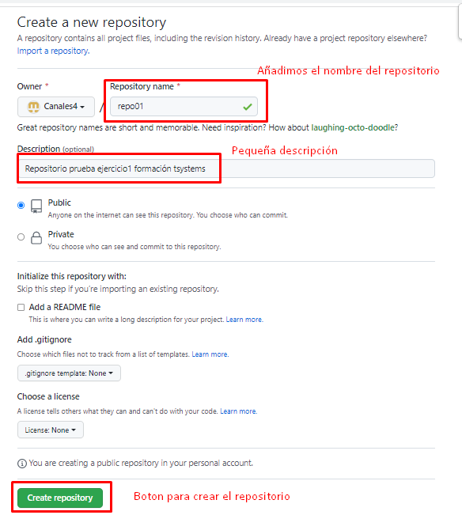

# PASOS A REALIZAR PARA EL EJERCICIO 1

 1. ## mkdir repo01
 ---
 2. ## cd repo01
 ---
 3. ## git init 
 ---
 4. ## touch readme.md 
 ---
 5. ## git add .
 ---
 6. ## git commit -m "Primera subida"
 ---
 7. 
 ## 
 ---
 8. 
 ##  
 ---
 9. ## git remote add origin https://github.com/Canales4/repo01.git
 ---
 10. ## git branch -M main
 ---
 11. ## git push -u origin main